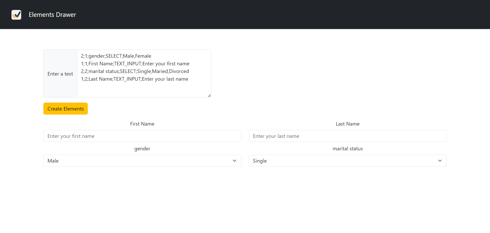
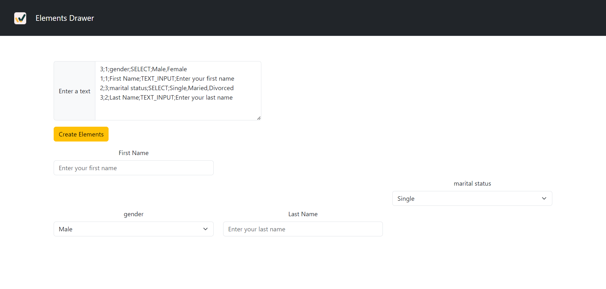

<h2>Elements Drawer</h2>

steps

<ul>
<li>git clone https://github.com/TamarCoe/winnercode.git</li>
<li>cd winnercode</li>
<li>npm i</li>
<li>npm start</li>

</ul>

<b>Bonus included 🤙</b>

<h3>Example</h3>

<h3>Example with empty col/row</h3>

